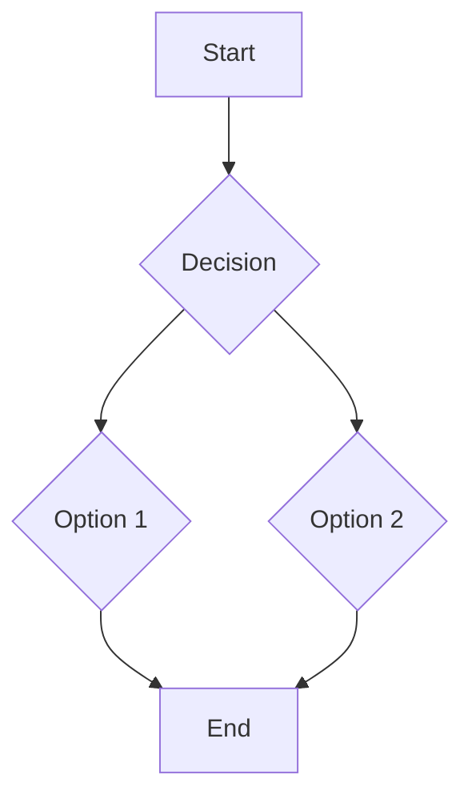
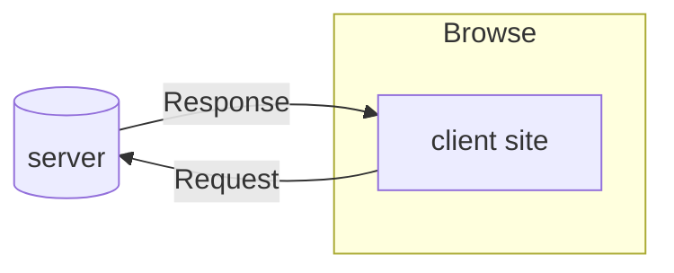

## Diagram-


<!--  -->
<!--  -->
<!--  -->
<!--  -->
<!--  -->

---

mermaid : https://mermaid.js.org/syntax/flowchart.html 2. https://www.mermaidflow.app/editor


```mermaid
graph TD;
    A[Start] --> B{Decision};
    B --> C{Option 1};
    B --> D{Option 2};
    C --> E[End];
    D --> E;

```

```markdown

```


```mermaid
graph LR
    %% Define the Server Node as a cylinder
    Server[("server")]

    %% Define the Client side within a Subgraph
    subgraph Browse
        Client["client site"]
    end

    %% Define the relationships
    %% Arrow from Client to Server labeled 'Request'
    Client -- "Request" --> Server

    %% Arrow from Server to Client labeled 'Response'
    Server -- "Response" --> Client
```
