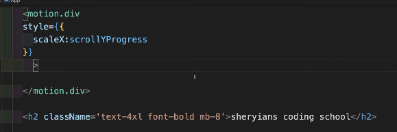

# Framer Motion Notes – Organized Guide

### Resources

- **Blog Post**: [Everything about Framer Motion Layout Animations](https://blog.maximeheckel.com/posts/framer-motion-layout-animations/?referrer=grok.com) – Deep dive into layout animations, layout prop, layoutId, LayoutGroup, and Reorder.
- **Official Docs Guide**: [React Animation Guide](https://motion.dev/docs/react-animation?referrer=grok.com) – Comprehensive tutorial on transforms, keyframes, transitions, gestures, variants, and more.
- **Other Links** (shared but inaccessible here):
  - Grok share: [https://grok.com/share/c2hhcmQtNA_6c4c5731-f823-420f-8fe8-c614a8bf5818](https://grok.com/share/c2hhcmQtNA_6c4c5731-f823-420f-8fe8-c614a8bf5818?referrer=grok.com)
  - NotebookLM: [https://notebooklm.google.com/notebook/e29143d0-0e45-4240-bec1-06aa73ba8069](https://notebooklm.google.com/notebook/e29143d0-0e45-4240-bec1-06aa73ba8069?referrer=grok.com)
  - [Sheryians Coding School](https://youtu.be/JALCoY9MQg8?si=KWb2KXuwbkViErDp)

---

# What is [Framer Motion](https://motion.dev/docs/react-animation?utm_source=chatgpt.com#what-you-ll-learn)

Framer Motion is an open-source animation library specifically designed for React. It allows developers to create animations and interactions with minimal code. Framer Motion is built on the foundation of the Framer library and provides a declarative API for defining animations, making it easy to create complex motion designs. It is widely used for:

- Creating smooth, fluid animations
- Enhancing user experience
- High performance

Is Framer Motion Good?
Framer Motion is considered one of the best animation libraries for React due to its:

- Ease of use
- Powerful features
- Community support

When to Choose Framer Motion:

- You are working primarily with React and want a library that integrates seamlessly with it.
- You need to quickly implement animations with a simple and declarative API.
- Your project involves a lot of interactive animations, such as drag, hover, and tap gestures.

When to Choose GSAP:

- You need advanced animation capabilities and highly customized animations.
- Your project is not limited to React, or you are using multiple frameworks.
- You require the use of GSAP's powerful plugins for tasks like scroll-based animations or complex SVG animations.

Framer Motion
Introduction to Framer Motion

- Overview of Framer Motion
- Key features and benefits
- Installing Framer Motion
- Basic project setup with React

Basic Animations

- Motion components (`motion.div', etc.) Animate props ('initial',` animate`,` exit`)
- Simple transitions
- Creating and using variants

Advanced Animations

- Using keyframes
- Drag animations
- Hover and tap animations
- Staggering animations
- Sequencing animations

Advanced Concepts

- Scroll animations ('useScroll, parallax effects)
- Animating layout
- Using AnimatePresence
- Creating custom animation hooks

Project-Based Learning (Next Videos)

- Project 1
- Project 2
- Project 3

---

### VS Code Tips

- Shortcut: rafce → React Arrow Function Component Export
- Recommended Extensions:
  - Simple React Snippets
  - ES7+ React/Redux/React-Native snippets
  - Material (Icon/Theme?)
  - Prettier

---

## Installation & Setup

- `npm i motion`
- `npm install framer-motion`

## [Import ](https://motion.dev/docs/react#install)

import { motion } from "motion/react”

## [Syntax](https://motion.dev/docs/react#your-first-animation)

To animate any element, you first need to enable it for animation. This is done by prefixing the HTML tag with `motion.`. This converts a standard element into a Motion component, giving it access to animation props.

EXAMPLE : `<motion.div><motion.div/>`
Replace HTML/SVG elements with motion. prefix: <motion.div>, <motion.h1>, <motion.circle>, etc.

---

Property : (prop) {{ (object in object) }}

Core Props – The "Big Four"

## Core Props – The "Big Four"

| Prop           | Purpose                                    | Example                                                                |
| -------------- | ------------------------------------------ | ---------------------------------------------------------------------- |
| **initial**    | Starting state                             | initial={{ opacity: 0, x: -100 }}                                      |
| **animate**    | Target/final state                         | animate={{ opacity: 1, x: 0 }}                                         |
| **transition** | Controls timing & behavior                 | transition={{ duration: 2, delay: 1, type: "spring", stiffness: 100 }} |
| **Gestures**   | Interactivity (whileHover, whileTap, etc.) | whileHover={{ scale: 1.1 }} whileTap={{ scale: 0.9 }}                  |
|                |                                            |                                                                        |

## Basic Animations

- Move, scale, rotate: animate={{ x: 1000, rotate: 360 }}
- Transition options:
  - duration (seconds)
  - delay
  - repeat: Infinity or number
  - ease: "anticipate", "easeIn", etc.
  - type: "spring" for bouncy feel

### Keyframes

Use arrays in animate for multi-step animations: e.g., `animate={{ x: [0, 800, 0] }}  // Go right, then back`

- **Gestures and Interactivity**:
  - `whileHover`: Animate on hover (e.g., scale up / scale: 1.1).
  - `whileTap`: Animate on click/tap (e.g., scale down / scale: 0.9).
  - [**Drag :**](https://motion.dev/docs/react-drag#:~:text=REACT-,Drag%20animation,-Drag%20animations%20allow)
    - [`drag`](https://motion.dev/docs/react-drag#:~:text=REACT-,Drag%20animation,-Drag%20animations%20allow): Make elements draggable. ( activate drage effect ) (or drag={true} / "x" / "y")
    - `whiledrag` : effects after drag elment
    - `dragConstraints`: Limit drag area (e.g., `{ left: 0, right: 100 }`).
    - `dragElastic={0.5}` (stretch beyond bounds)
    - `dragDirectionLock` : dragDirectionLock is a boolean prop in Framer Motion (available on motion components like motion.div) that controls draggable behavior. ( one time one way movement )
      _Example:_ `<motion.button whileHover={{ scale: 1.1 }} whileTap={{ scale: 0.9 }} drag whiledrag={{scale:0.5}} >`

```

<motion.div
  drag
  dragDirectionLock
  whileDrag={{ scale: 0.5 }}
  whileHover={{ scale: 1.1 }}
  whileTap={{ scale: 0.9 }}
/>

```

- [**Scroll-Based Animations**:](https://motion.dev/docs/react-use-scroll?transition=%257B%2522type%2522%253A%2522easing%2522%252C%2522edited%2522%253Atrue%252C%2522easing%2522%253A%257B%2522duration%2522%253A3%252C%2522ease%2522%253A%255B0.214%252C1.659%252C0.253%252C0.638%255D%257D%252C%2522spring%2522%253A%257B%2522duration%2522%253A0.3%252C%2522bounce%2522%253A0.2%252C%2522stiffness%2522%253A1000%252C%2522damping%2522%253A100%252C%2522mass%2522%253A1%252C%2522type%2522%253A%2522time%2522%252C%2522useVisualDuration%2522%253Atrue%257D%257D)
  - `scrollX`
  - `scrollY`
  - `scrollXProgress`
  - `scrollYProgress`
  - `useScroll` : It is a function that return object .
  - Use `useScroll` hook: `const { scrollYProgress } = useScroll()`.
  - Bind to elements, e.g., animate a progress bar's width based on scroll position.
  - Example: Sticky top bar that expands as user scrolls.
  - Control origin: `transformOrigin: "left"`.
    

---

## Layout Animations (From Maxime Heckel's Blog)

### Key Features

- layout prop: Automatically animates position & size changes on re-render.
  - layout={true} → animates both
  - layout="position" → only position (prevents content squish)
  - layout="size" → only size

### Shared Layout (layoutId)

- Same layoutId across components → animates as if it's the same element moving.
- Use for tabs indicators, selected states.

### LayoutGroup

- Namespaces layoutIds to avoid conflicts.
- Groups siblings for coordinated layout shifts.

### Reorder (Drag-to-Reorder Lists)

- <Reorder.Group> + <Reorder.Item> for draggable, animated reordering.

### Best Practices

- Use inline styles for animatable CSS (border-radius, box-shadow) to avoid glitches.
- Combine with AnimatePresence for enter/exit.
- layout="position" on inner content to prevent distortion.

## Advanced Concepts

- **Variants**: Reusable named states (great for orchestration & staggering children).
- **AnimatePresence**: For exit animations before unmount.
- **whileInView**: Trigger on scroll into view.
- **useAnimate** hook: Manual animation control.
- Integration: Works well with Tailwind CSS.

## Learning Path

1. Basics: motion components, initial/animate/transition
2. Gestures & Drag
3. Keyframes & Variants
4. Scroll & Layout Animations
5. Projects: Build interactive components (tabs, lists, cards)

**Tip**: Always code along with tutorials for best retention! Framer Motion makes React UIs feel alive and polished.
