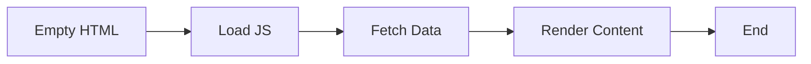
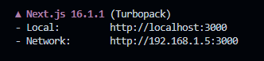

<!--  -->

# Module 69.1

## React in a Nutshell: The Core Principles

1. Component-Based UI : Building complex Uls from small, isolated, and readability - reusable pieces.
2. Hool API : Enabling state and lifecycle features within functional components, simplifying logic reuse.
3. Virtual DOM : An efficient update mechanism that minimises direct manipulation of the browser's DOM for performance gains.
4. SPA Benefits : Delivering dynamic, app-like experiences with seamless transitions and responsive interactions.

## Why We Choose React Over Vanilla JavaScript

1. Component Reusability : React's modular structure promotes efficient code reuse across different parts of an application.
2. Faster Rendering : The Virtual DOM optimises Ul updates, leading to a smoother and more performant user experience.
3. Vast Ecosystem : A rich array of libraries, tools, and a large community support React development, offering solutions for almost any problem.
4. Simplified State Management : React provides clear patterns for managing Ul state, making complex applications easier to dev

## React's Limitations: Challenges in Isolation

1. SEO Challenges : Clint-Side Rendering can hinder search engine optimisation, as content is not immediately available to crawlers.
2. Client-Side Only :Primarily focused on client-side rendering, which can impact initial load times and overall performance.
3. Slow First Contentful Paint : Users often experience a blank page while JavaScript loads, leading to a poorer initial user experience.

---


---

## React's Limitations: Challenges in Isolation

1. No Built-in Routing : Requires external libraries like React Router for navigation, adding to project setup complexity.
2. Performance Heavy on Client : Heavy reliance on client-side processing can strain device resources, especially on less powerful hardware.
3. Reliance on External Libraries : Projects often depend on numerous third-party libraries for essential functionalities, increasing bundle size and maintenance overhead.
   - TanStack : to fetch data
   - Firebase : for authentication
   - Axios - to fetch data
   - React Router - for page routing
   - Express JS - backend
   - npm - npm is the default package manager for the JavaScript runtime environment Node.js.

## Client-Side Rendering (CSR): The Traditional Flow

In CSR, the browser receives a minimal HTML document and then fetches and executes JavaScript to render the full content.

Empty HTML
Load JS
Fetch Data
Render Content



This model can lead to slower initial page loads and SEO issues as search engines might struggle to index dynamic content.

## Next.js to the Rescue: Overcoming React's Limitations

Next.js was created to address the inherent challenges of pure Client-Side Rendered React applications.

1. SEO Friendly : Utilises Server-Side Rendering (SSR) and Static Site Generation (SSG) for better search engine indexing.
2. Faster Initial Load : Pre-rendering strategies deliver fully formed HTML to the browser, significantly improving First Contentful Paint.
3. Built-in Routing : Offers an intuitive file-system based routing solution, simplifying navigation setup.
4. API Routes & Optimisation : Provides API routes for backend functionalities and optimisations for images and fonts out-of-the-box.

---

| React Limitation         | Next.js Solution                  | Benefit                                                                                 |
| ------------------------ | --------------------------------- | --------------------------------------------------------------------------------------- |
| SEO Issues               | SSR / SSG                         | Improved search engine visibility and ranking.                                          |
| No Built-in Routing      | File-Based Routing                | Simplified, intuitive navigation and URL management.                                    |
| Complex Data Fetching    | Server Components, 'fetch' API    | Streamlined data access directly on the server, reducing client-side load.              |
| Slow Initial Performance | Pre-rendering, Image Optimisation | Faster page loads, better user experience, and improved Core Web Vitals.                |
| No Backend               | API Routes, Middleware            | Full-stack capabilities within a single codebase, eliminating separate backend servers. |

---

## From Fragmented Ecosystem to Unified Framework

Before Next.js, building a full-stack React application required integrating numerous disparate libraries and tools.

- React Ecosystem (Before Next.js)
  1. React Router for navigation
  2. React Router
  3. Express.js for backend
  4. Axios/Fetch for data requests
  5. TanStack Query for state management
  6. Firebase for database/auth
  7. Manual SEO solutions
  8. Complex deployment strategies
  9. Firebase
  10. ExpressJS
  11. TanStack Query
  12. axios
- Next.js All-in-One Approach
  1. Built-in Router
  2. Integrated API Routes
  3. Middleware for request handling
  4. Incremental Static Regeneration (ISR)
  5. Automated Image Optimisation
  6. Full-stack development capabilities

---

Framework vs. Library: A Clear Distinction

**Next.js: The Full Framework**

- Routing
- Authentication
- Caching
- Optimization
- API Dev.
- Built-in features

Offers a comprehensive structure and opinionated solutions for building production-ready React applications. It integrates routing, data fetching and build optimization

**React: The UI Library**

- Built-in Functions
- UI management
- Flexibility

Provides tools for building user interfaces. It's a foundation that allows developers immense flexibility but requires ... for a complete application.

---

**Next.js: The Modern Choice for Production-Grade Applications**

By embracing Next.js, we leverage a powerful tool that transforms React into a full-stack, high-performance platform.

- **Enhanced SEO**

Achieve higher search engine rankings with server-side rendering and static site generation.

- **Superior Performance**

Deliver lightning-fast load times and smooth user experiences through advanced optimisations.

- **Full-Stack Capabilities**

**Develop both frontend and backend within a single, cohesive framework.**

- **Industry Standard**

Align with current industry best practices and a thriving developer ecosystem.

---

# Module 69.2

## [Instalation](https://nextjs.org/docs/app/getting-started/installation#quick-start) ❌

1. Create a new Next.js app named my-app
2. cd my-app and start the dev server.
3. Visit http://localhost:3000.

```
npx create-next-app@latest my-app --yes
cd my-app
npm run dev
```

--yes skips prompts using saved preferences or defaults. The default setup enables TypeScript, Tailwind, ESLint, App Router, and Turbopack, with import alias @/\*.

- Type `node -v` to node.js version [Minimum Node.js version: 20.9]

## Create with the CLI ✅

The quickest way to create a new Next.js app is using create-next-app, which sets up everything automatically for you. To create a project, run:

```
npx create-next-app@latest
```

- then press `y`
- file name : `my-app` or path define `.`
- choose `No, customize settings`
- Would you like to use TypeScript? - `no`
- Which linter would you like to use? `ESLint`
- Would you like to use React Compiler? » `No` / Yes
- √ Would you like to use Tailwind CSS? ... No / `Yes`
- √ Would you like your code inside a `src/` directory? ... No / `Yes`
- √ Would you like to use App Router? (recommended) ... No / `Yes`
- √ Would you like to customize the import alias (`@/*` by default)? ... `No` / Yes

## Manual installation

To manually create a new Next.js app, install the required packages: [not recomended]

```
npm i next@latest react@latest react-dom@latest

```

---

## after intalation run the code :

1. To start the code : `npm run dev`



2. search localhost in chrome , then it will start compiling : http://localhost:3000
3. it is ready :
   

## file structure explain :

- [src floder](https://nextjs.org/docs/app/api-reference/file-conventions/src-folder#:~:text=Copy%20page-,src%20Folder,-Last%20updated%20October)
  - favicon
  - globalcss.css - all required css
  - layout.js - root file
  - page.js - childern of root file

---

## file structure explain :

When you create a new **Next.js** project with `npx create-next-app@latest` (Next.js 15+ as of late 2025) and select **no TypeScript** (while keeping other defaults like ESLint, Tailwind CSS, src/ directory if chosen, and App Router), the structure is very similar to the TypeScript version but uses plain JavaScript files.

The main differences are:

- Files in `app/` use `.js` (or `.jsx` if needed) instead of `.tsx`.
- No `tsconfig.json`.
- Includes `jsconfig.json` for better editor support (like path aliases and IntelliSense in VS Code).
- Tailwind config remains `.ts` (or `.js` in some setups), but it's compatible.

Here's the typical default structure (assuming you selected the optional `src/` directory, as many do for organization; if not, `app/` and `public/` are directly in the root).

```
my-next-app/
├── app/                  # Core routing and UI (App Router)
│   ├── layout.js         # Root layout (required, wraps all pages with <html> and <body>)
│   ├── page.js           # Home page (renders at /)
│   ├── globals.css       # Global styles (includes Tailwind base if selected)
│   └── favicon.ico       # Default favicon
├── public/               # Static assets (served as-is)
│   └── vercel.svg        # Example image (or similar placeholder)
├── src/                  # Optional: All application code (if selected; otherwise app/ is at root)
│   └── (app/ moves here as src/app/ if chosen)
├── .gitignore
├── jsconfig.json         # JavaScript config for editor features (replaces tsconfig.json)
├── next.config.js        # Next.js configuration
├── package.json
├── tailwind.config.ts    # Tailwind config (often .ts even in JS projects; works fine)
├── postcss.config.js     # For Tailwind/PostCSS
├── eslint.config.mjs     # ESLint config (if selected)
└── README.md
```

### Key Folders Explained (Same as TypeScript Version)

- **app/** → Defines routes via folder structure.

  - Nested folders = nested routes (e.g., `app/blog/page.js` → `/blog`).
  - Special files: `layout.js`, `page.js`, `loading.js`, `error.js`, etc.
  - Root `app/layout.js` is required for the whole app.
  - Root `app/page.js` is your homepage.

- **public/** → Static files like images, fonts, etc. (e.g., `/public/logo.png` → accessible at `/logo.png`).

- **src/** (optional) → Keeps your code separate from config files. Highly recommended for medium+ projects.

### Other Notes

- You can still add JSX in `.js` files (Next.js handles it).
- If you later want TypeScript, just rename files to `.tsx` and add `tsconfig.json`—Next.js supports it seamlessly.
- As you build, common additions: `middleware.js`, `components/` folder, `lib/` or `utils/` for helpers.

## This setup leverages React Server Components by default, just like the TypeScript version. For the absolute latest details, refer to the official Next.js docs at nextjs.org/docs/getting-started/project-structure. Start building—it's straightforward in plain JS!

# Module 69.3

---
