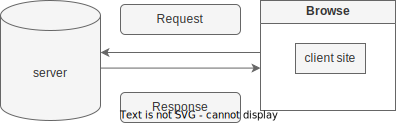
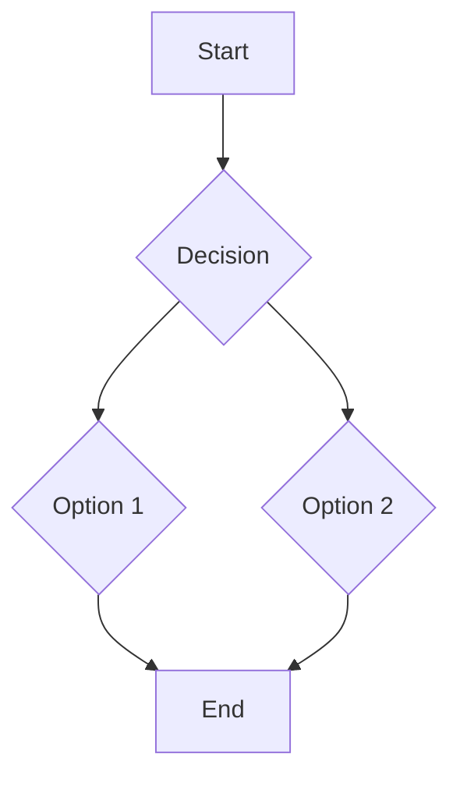

<!--  -->

# 69.1 :

## React in a Nutshell: The Core Principles

1. Component-Based UI : Building complex Uls from small, isolated, and readability - reusable pieces.
2. Hool API : Enabling state and lifecycle features within functional components, simplifying logic reuse.
3. Virtual DOM : An efficient update mechanism that minimises direct manipulation of the browser's DOM for performance gains.
4. SPA Benefits : Delivering dynamic, app-like experiences with seamless transitions and responsive interactions.

## Why We Choose React Over Vanilla JavaScript

1. Component Reusability : React's modular structure promotes efficient code reuse across different parts of an application.
2. Faster Rendering : The Virtual DOM optimises Ul updates, leading to a smoother and more performant user experience.
3. Vast Ecosystem : A rich array of libraries, tools, and a large community support React development, offering solutions for almost any problem.
4. Simplified State Management : React provides clear patterns for managing Ul state, making complex applications easier to dev

## React's Limitations: Challenges in Isolation

1. SEO Challenges : Clint-Side Rendering can hinder search engine optimisation, as content is not immediately available to crawlers.
2. Client-Side Only :Primarily focused on client-side rendering, which can impact initial load times and overall performance.
3. Slow First Contentful Paint : Users often experience a blank page while JavaScript loads, leading to a poorer initial user experience.

---


---

## React's Limitations: Challenges in Isolation

1. No Built-in Routing : Requires external libraries like React Router for navigation, adding to project setup complexity.
2. Performance Heavy on Client : Heavy reliance on client-side processing can strain device resources, especially on less powerful hardware.
3. Reliance on External Libraries : Projects often depend on numerous third-party libraries for essential functionalities, increasing bundle size and maintenance overhead.
   - TanStack : to fetch data
   - Firebase : for authentication
   - Axios - to fetch data
   - React Router - for page routing
   - Express JS - backend
   - npm - npm is the default package manager for the JavaScript runtime environment Node.js.

## Client-Side Rendering (CSR): The Traditional Flow

In CSR, the browser receives a minimal HTML document and then fetches and executes JavaScript to render the full content.

Empty HTML
Load JS
Fetch Data
Render Content
This model can lead to slower initial page loads and SEO issues as search engines might struggle to index dynamic content.



```markdown

```
